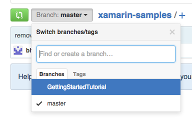

#EMDK for Xamarin Sample and Tutorial Projects

This repository contains sample and tutorial projects using the EMDK for Xamarin Component

> When a using a component in a Xamarin project, a complete copy of that component gets copied to the project's component folder. The version of the EMDK for Xamarin component in the project will be the version that was available when the project was originally created. If you would like to make use of features in the latest component, you will need to upgrade the component my following the instructions in the [Upgrade EMDK for Xamarin Component](https://github.com/EMDK/xamarin-samples/tree/master#upgrade-emdk-for-xamarin-component) section below. 

##Download Projects
###Samples

* [BarcodeSample1]()
* [ProfileDataCaptureSample1]()

###Tutorials

* [GettingStartedTutorial](https://github.com/EMDK/xamarin-samples/archive/GettingStartedTutorial.zip)
	* - [View project details](https://github.com/EMDK/xamarin-samples/tree/GettingStartedTutorial)

## Upgrade EMDK for Xamarin Component
Placeholder for component upgrade instructions

<!---->

